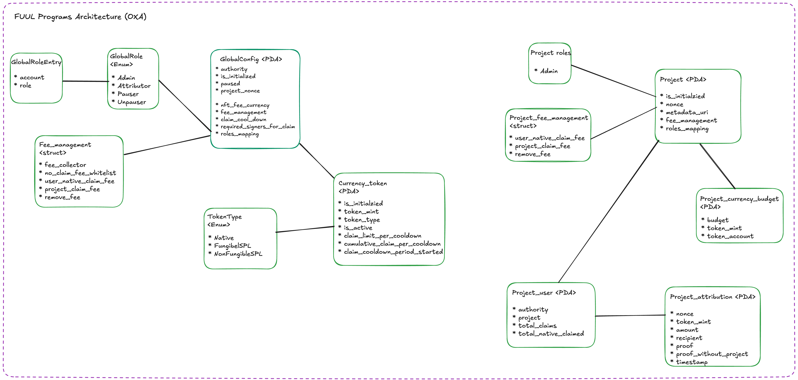
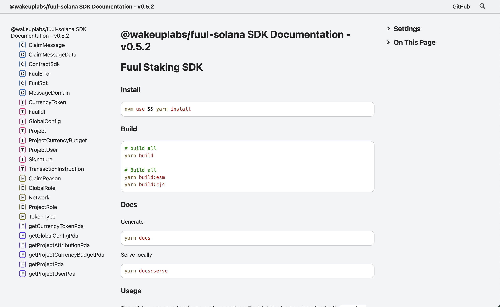

# Fuul Solana

## Architecture Overview

Overview diagram:



## Documentation

You can find documentation about the project split across:

- This document

  For global related setups, commands, flows, etc

- `programs/fuul-solana/README.md`

  For documentation on the solana programs/contracts.

- `packages/fuul-solana/README.md`

  For setup instructions on the SDK and how to generate (typedoc) and serve (serve) de documentation for the sdk. Hint: it's `yarn docs && yarn docs:serve`

  It should look like this:

  

## Folder Organization

The project follows a structured folder organization to promote maintainability and clarity:

### Core Directories

- **`/programs`**: Contains on-chain Solana programs (smart contracts), written in Rust using the Anchor framework.
  - `fuul-solana/`: Main program implementation
    - `src/lib.rs`: Program entry point and instruction handlers
    - `src/instructions/`: Individual instruction implementations
    - `src/state/`: Account state structures (GlobalConfig, Project, CurrencyToken, etc.)
    - `src/utils/`: Utility modules (control, signatures, transfer, bumps)
    - `src/constants.rs`: Program constants and PDA seeds
    - `src/errors.rs`: Custom error definitions

- **`/packages`**: Contains TypeScript packages and SDKs for interacting with the program.
  - `fuul-solana/`: Main SDK package
    - `src/`: TypeScript source code
      - `index.ts`: Main SDK entry point
      - `accounts.ts`: Account deserialization utilities
      - `instructions/`: Instruction builders for all program instructions
      - `pdas.ts`: PDA derivation utilities
      - `sdks/`: SDK implementations (FuulSdk, etc.)
      - `idls/`: Generated IDL files and TypeScript types
      - `common/`: Shared utilities and types
      - `utils/`: Helper functions
    - `dist/`: Compiled output (ESM and CJS formats)
    - `docs/`: Generated TypeScript documentation

- **`/scripts`**: CLI scripts for interacting with the program and managing deployments.
  - `index.ts`: Main script entry point
  - `commands/`: Command implementations organized by feature
  - `utils/`: Shared utilities for scripts (connection, wallet, explorer)

- **`/tests`**: Test suites for validating program functionality.
  - `instructions/`: Unit tests for individual instructions
  - `integration/`: End-to-end integration tests
  - `utils/`: Test utilities and fixtures

### Supporting Directories

- **`/keys`**: Keypair files for development and testing (should not be committed to version control).
  - Contains keypairs for various roles: admin, project-admin, project-user, fee-collector, minter, etc.

## Setup

### Requirements

- Node.js = v23
- Rust = 1.90.0
- Solana Cli = 2.3.13 / Agave
- Anchor = 0.32.1
- Avm installed (anchor version manager)

### Anchor, Rust & Solana

* For this step, please follow the [official anchor documentation](https://www.anchor-lang.com/docs/installation)

- Install dependencies

```bash
nvm use && yarn install
```

## Available Commands

#### Build Commands

- **Build everything** (programs + SDK)

```bash
yarn build:all
```

- **Build Solana programs only**

```bash
yarn build:programs
```

- **Build SDK only**

```bash
yarn build:sdk
```

#### Linting Commands

- **Lint everything** (programs + SDK)

```bash
yarn lint:all
```

- **Lint programs only** (Rust + TypeScript tests/scripts)

```bash
yarn lint:programs
```

- **Lint SDK only**

```bash
yarn lint:sdk
```

- **Fix linting issues for everything**

```bash
yarn lint:fix:all
```

- **Fix linting issues for programs**

```bash
yarn lint:fix:programs
```

- **Fix linting issues for SDK**

```bash
yarn lint:fix:sdk
```

#### Clean Commands

- **Clean everything** (programs + SDK)

```bash
yarn clean:all
```

- **Clean program build artifacts**

```bash
yarn clean:programs
```

- **Clean SDK build artifacts**

```bash
yarn clean:sdk
```

#### Test Commands

- **Run all tests**

```bash
yarn test:all
```

#### SDK Preparation

- **Prepare SDK** (builds programs, copies IDL and types, fixes linting)

```bash
yarn prepare:sdk
```

#### Documentation Commands

- **Generate SDK documentation**

```bash
yarn docs:sdk
```

- **Serve SDK documentation locally**

```bash
yarn docs:sdk:serve
```

#### Scripts/CLI

- **Run CLI scripts** (see Scripts section below for available commands)

```bash
yarn scripts [command] [options]
```

## Deployment

### New deployment

0. Create keypairs for program deployment, admin, etc and setup enviroment variables

```bash
solana-keygen new --outfile ./keys/admin.json
solana-keygen new --outfile ./keys/program.json

export ADMIN_ACC=$(solana-keygen pubkey ./keys/admin.json)
export ADMIN_KEYPAIR="./keys/admin.json"
```

> `keys/program.json` influences in the program_id, to keep same program_id across networks/chains keep that unchanged.

> As security practice you may want to use different keys between testing networks and mainnet.

1. Start the local node (localhost only)

```bash
solana-test-validator --reset
```

2. Fund wallet

In localhost you can do:

```bash
solana airdrop 5 --url localhost --keypair $ADMIN_KEYPAIR
solana balance --keypair $ADMIN_KEYPAIR --url localhost
```

Anywhere else just make sure to fund the wallet at:

```bash
solana address --keypair $ADMIN_KEYPAIR 
```

3. Sync keys

Ensure your generated program key overwrites the default one:

```bash
anchor build && cp ./keys/program.json ./target/deploy/fuul_solana-keypair.json
```

```bash
anchor keys sync --program-name fuul_solana --provider.cluster <CLUSTER> --provider.wallet ./keys/admin.json 

# Example localhost
anchor keys sync --program-name fuul_solana --provider.cluster localnet --provider.wallet ./keys/admin.json 
# Syncing program ids for the configured cluster (localnet)
# 
# Found incorrect program id declaration in ".../programs/fuul-solana/src/lib.rs"
# Updated to 7BLkgULKe2eMmrjqMZUSaX8iGsaStue9LgZTQuEpTBEg
# 
# Found incorrect program id declaration in Anchor.toml for the program `fuul_solana`
# Updated to 7BLkgULKe2eMmrjqMZUSaX8iGsaStue9LgZTQuEpTBEg
# 
# All program id declarations are synced.
# Please rebuild the program to update the generated artifacts.


# Example devnet
anchor keys sync --program-name fuul_solana --provider.cluster devnet --provider.wallet ./keys/admin.json 
# Syncing program ids for the configured cluster (devnet)
# All program id declarations are synced.

# Example fogo
anchor keys sync --program-name fuul_solana --provider.cluster https://testnet.fogo.io --provider.wallet ./keys/admin.json 
# Syncing program ids for the configured cluster (devnet)
# All program id declarations are synced.
```

4. Only if program-id was updated (a new program key was used):

```bash
yarn scripts compute-pdas --network <NETWORK> --program-id <PROGRAM_ID>

# Example localhost
yarn scripts compute-pdas --network localhost --program-id 7BLkgULKe2eMmrjqMZUSaX8iGsaStue9LgZTQuEpTBEg
# GLOBAL CONFIG PDA: 6tmBxYUDkm8xg2NybDU5hgrpHLgs4gT1CPF1ngkQe9iY
# GLOBAL CONFIG BUMP: 255


# Example devnet
yarn scripts compute-pdas --network devnet --program-id 7BLkgULKe2eMmrjqMZUSaX8iGsaStue9LgZTQuEpTBEg
# GLOBAL CONFIG PDA: 6tmBxYUDkm8xg2NybDU5hgrpHLgs4gT1CPF1ngkQe9iY
# GLOBAL CONFIG BUMP: 255


# Example fogo
yarn scripts compute-pdas --network fogo-testnet --program-id 7BLkgULKe2eMmrjqMZUSaX8iGsaStue9LgZTQuEpTBEg
# GLOBAL CONFIG PDA: 6tmBxYUDkm8xg2NybDU5hgrpHLgs4gT1CPF1ngkQe9iY
# GLOBAL CONFIG BUMP: 255
```

Then update `programs/fuul-solana/constants.rs` and `programs/fuul-solana/constants.ts`. Once done rebuild the sdk:

```bash
yarn prepare:sdk && yarn build:sdk && yarn test:all
```

5. Lastly rebuild and deploy

```bash
anchor build && anchor deploy --program-name fuul_solana --provider.cluster <CLUSTER> --provider.wallet ./keys/admin.json --program-keypair ./keys/program.json

# Example localhost
anchor build && anchor deploy --program-name fuul_solana --provider.cluster localnet --provider.wallet ./keys/admin.json --program-keypair ./keys/program.json
# ...
# Deploying cluster: http://0.0.0.0:8899
# Upgrade authority: ./keys/admin.json
# Deploying program "fuul_solana"...
# Program path: .../target/deploy/fuul_solana.so...
# Program Id: 7BLkgULKe2eMmrjqMZUSaX8iGsaStue9LgZTQuEpTBEg
# ...
# Deploy success

# Example devnet
anchor build && anchor deploy --program-name fuul_solana --provider.cluster devnet --provider.wallet ./keys/admin.json --program-keypair ./keys/program.json
# Deploying cluster: https://api.devnet.solana.com
# Upgrade authority: ./keys/admin.json
# Deploying program "fuul_solana"...
# Program path: .../target/deploy/fuul_solana.so...
# Program Id: 7BLkgULKe2eMmrjqMZUSaX8iGsaStue9LgZTQuEpTBEg
# 
# Signature: 2VPiZYJV8dcdFvRyx2g1TNruVSAaeutphCofwHMq3aATBQeKA4yFQpKJC7Ur3r1rxEFV9c5LiGKpmwShRWwRWMYh
# ...
# Idl account created: 9ph9ubsgV1QcSKTLD9qphrX2ykmH6ENv4seuRwBtYKGF
# Deploy success


# Example 
anchor build && anchor deploy --program-name fuul_solana --provider.cluster https://testnet.fogo.io --provider.wallet ./keys/admin.json --program-keypair ./keys/program.json
# Deploying cluster: https://testnet.fogo.io
# Upgrade authority: ./keys/admin.json
# Deploying program "fuul_solana"...
# Program path: /Users/matzapata/git-work/fuul/fuul-solana-wakeup/target/deploy/fuul_solana.so...
# Program Id: 7BLkgULKe2eMmrjqMZUSaX8iGsaStue9LgZTQuEpTBEg
# 
# Signature: M7m8oCJwF1qxzaRNyw8pfBhZmutqa1ukyafdDkf2yUdG48vnL5EEmEeMJJgHuevRA38aWSdcjiXsYEqzHQuS3SK
# 
# Idl account created: AEH7vTHUtBhQqepWrZqXJ8dMsYpwB4eGExBxm73bhCpG
# Deploy success
```

6. Done! You can now follow a whole flow like described below in `## E2E Flows`

### Upgrade deployment steps:

For upgrading an existing deployed program, follow these steps:

1. Build the updated program and make your code changes and ensure all tests pass

```bash
anchor build && yarn test:all
```

2. Verify the upgrade authority

```bash
solana program show <PROGRAM_ID> --url <NETWORK_URL>

# Example for localhost:
solana program show 7BLkgULKe2eMmrjqMZUSaX8iGsaStue9LgZTQuEpTBEg --url localhost

# Example for devnet:
solana program show 7BLkgULKe2eMmrjqMZUSaX8iGsaStue9LgZTQuEpTBEg --url devnet

# Example for fogo
solana program show 7BLkgULKe2eMmrjqMZUSaX8iGsaStue9LgZTQuEpTBEg --url https://testnet.fogo.io
```

This will show you who has upgrade authority. Make sure you have the keypair for the upgrade authority.

3. Deploy the upgrade

```bash
anchor upgrade --program-id <PROGRAM_ID> --provider.cluster <CLUSTER> --provider.wallet <UPGRADE_AUTHORITY_KEYPAIR> target/deploy/fuul_solana.so

# Example for localhost:
anchor upgrade --program-id 7BLkgULKe2eMmrjqMZUSaX8iGsaStue9LgZTQuEpTBEg --provider.cluster localnet --provider.wallet ./keys/admin.json target/deploy/fuul_solana.so

# Example for devnet:
# - https://solscan.io/tx/3jE1QpSBmnkAiTT7F1LyEM4kn9UfxJgSBQBtoo3GebA6dhw4pCC2asyh6TSpWAnbq7nvYDKygGotXBPZawK25SM9?cluster=devnet
anchor upgrade --program-id 7BLkgULKe2eMmrjqMZUSaX8iGsaStue9LgZTQuEpTBEg --provider.cluster devnet --provider.wallet ./keys/admin.json target/deploy/fuul_solana.so

# Example for fogo testnet:
# https://explorer.fogo.io/tx/4TJQU5B3xPZV6ZQ4h51EXTjrguJZFKNnGbz582vcN9cEfHMZe8oUqsUuUZdPrws8vEwQCLThaFUSZYAYDrQRXFnC?cluster=testnet
anchor upgrade --program-id 7BLkgULKe2eMmrjqMZUSaX8iGsaStue9LgZTQuEpTBEg --provider.cluster https://testnet.fogo.io --provider.wallet ./keys/admin.json target/deploy/fuul_solana.so
```


## Scripts

To find all available scripts do:

```bash
yarn scripts --help
```

Example:

```bash
yarn scripts compute-pdas --help
# Usage: compute-pdas [options]

# Options:
#   -n, --network <network>  The network to use (devnet, mainnet-beta, testnet, localhost)
#   -h, --help               display help for command
```

## E2E Flows

### Setup

0. Deploy as per described above

1. Create accounts for testing

```bash
# Create accounts ========================================================

# solana-keygen new --outfile ./keys/admin.json should already be available
solana-keygen new --outfile ./keys/fee-collector.json
solana-keygen new --outfile ./keys/project-admin.json
solana-keygen new --outfile ./keys/project-user.json
solana-keygen new --outfile ./keys/random.json
solana-keygen new --outfile ./keys/minter.json

# Export useful env variables ===============================================

# localhost, devnet, testnet, mainnet-beta, fogo-testnet, fogo-mainnet
export NETWORK="localhost" 

export ADMIN_ACC=$(solana-keygen pubkey ./keys/admin.json)
export ADMIN_KEYPAIR="./keys/admin.json"

export FEE_COLLECTOR_ACC=$(solana-keygen pubkey ./keys/fee-collector.json)
export FEE_COLLECTOR_KEYPAIR="./keys/fee-collector.json"

export PROJECT_ADMIN_ACC=$(solana-keygen pubkey ./keys/project-admin.json)
export PROJECT_ADMIN_KEYPAIR="./keys/project-admin.json"

export PROJECT_USER_ACC=$(solana-keygen pubkey ./keys/project-user.json)
export PROJECT_USER_KEYPAIR="./keys/project-user.json"

export RANDOM_ACC=$(solana-keygen pubkey ./keys/random.json)
export RANDOM_KEYPAIR="./keys/random.json"

export MINTER_ACC=$(solana-keygen pubkey ./keys/minter.json)
export MINTER_KEYPAIR="./keys/minter.json"

# Airdrop some SOL to each account (will only work in localhost) ============

solana airdrop 5 --url localhost --keypair $ADMIN_KEYPAIR
solana airdrop 5 --url localhost --keypair $FEE_COLLECTOR_KEYPAIR
solana airdrop 5 --url localhost --keypair $PROJECT_ADMIN_KEYPAIR
solana airdrop 5 --url localhost --keypair $PROJECT_USER_KEYPAIR
solana airdrop 5 --url localhost --keypair $RANDOM_KEYPAIR
solana airdrop 5 --url localhost --keypair $MINTER_KEYPAIR

# In devnet or mainnet you can do transfers
export FAUCET_KEYPAIR=./keys/faucet.json # Just some account with SOL to donate to other accounts
solana transfer $ADMIN_ACC 0.1 --keypair  $FAUCET_KEYPAIR --url $NETWORK --allow-unfunded-recipient
solana transfer $FEE_COLLECTOR_ACC 0.1 --keypair $FAUCET_KEYPAIR --url $NETWORK --allow-unfunded-recipient
solana transfer $PROJECT_ADMIN_ACC 0.1 --keypair $FAUCET_KEYPAIR --url $NETWORK --allow-unfunded-recipient
solana transfer $PROJECT_USER_ACC 0.1 --keypair $FAUCET_KEYPAIR --url $NETWORK --allow-unfunded-recipient
solana transfer $RANDOM_ACC 0.1 --keypair $FAUCET_KEYPAIR --url $NETWORK --allow-unfunded-recipient
solana transfer $MINTER_ACC 0.1 --keypair $FAUCET_KEYPAIR --url $NETWORK --allow-unfunded-recipient

# Check balances with:
solana balance --keypair $ADMIN_KEYPAIR --url $NETWORK
solana balance --keypair $FEE_COLLECTOR_KEYPAIR --url $NETWORK
solana balance --keypair $PROJECT_ADMIN_KEYPAIR --url $NETWORK
solana balance --keypair $PROJECT_USER_KEYPAIR --url $NETWORK
solana balance --keypair $RANDOM_KEYPAIR --url $NETWORK
solana balance --keypair $MINTER_KEYPAIR --url $NETWORK
```

2. Create tokens

```bash 
# create fungible token
spl-token create-token --decimals 6 --owner $MINTER_ACC --fee-payer $MINTER_KEYPAIR --url $NETWORK
spl-token create-token --decimals 0 --owner $MINTER_ACC --fee-payer $MINTER_KEYPAIR --url $NETWORK

# devnet tokens
export FUNGIBLE_TOKEN_MINT_ADDRESS=F4uGqHk2tpa1iKfXKreikpGAXPntkQgicbpHvmie7Vwt
export NON_FUNGIBLE_TOKEN_MINT_ADDRESS=R92bRFAkL3qaywLrjJCrgWnpM7AyFzGjH3bFFER3mt3
# fogo testnet tokens
export FUNGIBLE_TOKEN_MINT_ADDRESS=Ag5fCKCW51j8s7dj3LJRARpXPkPMavwre23nBGLbRPBT
export NON_FUNGIBLE_TOKEN_MINT_ADDRESS=9Hd1wXnYqqvn21WRwJgk92zXyDex2KpxxvGqFAQaapBe

# Create ata for the project admin (if not existent)
spl-token create-account $FUNGIBLE_TOKEN_MINT_ADDRESS --owner $PROJECT_ADMIN_ACC --fee-payer $PROJECT_ADMIN_KEYPAIR --url $NETWORK
spl-token create-account $NON_FUNGIBLE_TOKEN_MINT_ADDRESS --owner $PROJECT_ADMIN_ACC --fee-payer $PROJECT_ADMIN_KEYPAIR --url $NETWORK

# devnet testing accounts
export PROJECT_ADMIN_FUNGIBLE_ATA=2VWoXZik6nvNGsvoJ5RYyePQvey8vdXjizsAwdqXWMvB
export PROJECT_ADMIN_NON_FUNGIBLE_ATA=CQV5wTc78QzFh7XxuDi6FYbDE4ahes8rgDUqStmUPnKt
# fogo testnet testing accounts
export PROJECT_ADMIN_FUNGIBLE_ATA=6dUfCyGdHrg6eC6beuFSvJnxfYcp7aXWKFkgkfJtVMHF
export PROJECT_ADMIN_NON_FUNGIBLE_ATA=Afrn6EEo9zbXHxNUXB5JAfCH578CKA1eSGvUQGmjZS9y

# Mint tokens
spl-token mint $FUNGIBLE_TOKEN_MINT_ADDRESS 1000000 $PROJECT_ADMIN_FUNGIBLE_ATA --mint-authority $MINTER_KEYPAIR --url $NETWORK
spl-token mint $NON_FUNGIBLE_TOKEN_MINT_ADDRESS 1 $PROJECT_ADMIN_NON_FUNGIBLE_ATA --mint-authority $MINTER_KEYPAIR --url $NETWORK
spl-token authorize $NON_FUNGIBLE_TOKEN_MINT_ADDRESS mint --disable --url $NETWORK --authority $MINTER_KEYPAIR

# check balances
spl-token balance --address $PROJECT_ADMIN_FUNGIBLE_ATA --url $NETWORK
spl-token balance --address $PROJECT_ADMIN_NON_FUNGIBLE_ATA --url $NETWORK
```

### Global config

**Create global config**


```bash 
# Create global config
# - Fogo testnet: https://explorer.fogo.io/tx/4wibb9NhEpYtTYGAKYBEGs8jdh9fiTsoiaUB5F9dSdeD8XsofBesQEvZ7PHXAZ5tghhPn4R7eK6JDaLo9HRhtnn9?cluster=testnet
# - Devnet: https://explorer.solana.com/tx/49AbizzbTLTiNV5XDRMynPRoiFjcrCJZ3c7LtokChXj57wqRqJVaUSfRGRvv8j4Z1eeWf2JJ5scRspBitwS7vXGe?cluster=devnet
yarn scripts create-global-config \
  --network $NETWORK \
  --keypair $ADMIN_KEYPAIR \
  --fee-collector $FEE_COLLECTOR_ACC
```

This creates the global config with default values:
- `claim-cool-down`: 86400 (1 day)
- `required-signers-for-claim`: 1
- `user-native-claim-fee`: 0
- `project-claim-fee`: 0
- `remove-fee`: 0

The creator is automatically granted Admin, Pauser, Unpauser, and Signer roles.

**Update global config**

Update config values after creation if needed:

```bash
# Update gobal config
# - Fogo testnet: https://explorer.fogo.io/tx/4Uq6eTi2RifxScaREEFk2oQgNr5XwwBGrb55hznVWkPCMd3P5aUS1JFCg6r8bRNwQ748qxpke6cY5HMFrtDBYTvZ?cluster=testnet
# - Devnet: https://explorer.solana.com/tx/59ngofcHC1MZnJK5ZmHn5AUF18C6nhk4zT7HJvJRwV7KMTHHji2SfMoD2wT5Bfd1MVV3XWxSYg6GEwMMcTiVmY2j?cluster=devnet
yarn scripts update-global-config \
  --network $NETWORK \
  --keypair $ADMIN_KEYPAIR \
  --claim-cool-down 86401

# Verify with
yarn scripts print-global-config --network $NETWORK
```

**Update global config fees**

```bash
# Update gobal config fees
# - Fogo testnet: https://explorer.fogo.io/tx/4bD7ARmKDug1hZXqcikFKdJRvGRFQEH7C48WDpk9xgg1Mgw1wDzZ4xLTiPJDHXCzUsFiqaNrPHheyun7iTLcGMkD?cluster=testnet
# - Devnet: https://explorer.solana.com/tx/3LqfX3s6LAfRRMGkuivKShBFxevnBJAqVPBjGapiYppSJ6qcnNT2AxKDmge69UHWM7PjfXiGrSNLpqByj7xW5jHj?cluster=devnet
yarn scripts update-global-config-fees \
  --network $NETWORK \
  --keypair $ADMIN_KEYPAIR \
  --user-native-claim-fee 10 \
  --project-claim-fee 100 \
  --remove-fee 100

# Verify with
yarn scripts print-global-config --network $NETWORK
```

Available fee options:
- `--fee-collector`: Address that collects protocol fees
- `--user-native-claim-fee`: Fixed fee in lamports paid by users per claim
- `--project-claim-fee`: Fee in basis points (0-10000) paid by projects per claim
- `--remove-fee`: Fee in basis points (0-10000) applied when removing funds from project

(You can supply any subset of these to update only certain fees or the collector.)

### Global Roles

Verify actions at any moment with `yarn scripts print-global-config --network $NETWORK`

**Assign global role**

```bash
# Assign role
# - Fogo testnet: https://explorer.fogo.io/tx/2iWpA175xnRuN6TMh7hQmFkviPXXSJZry5hmr1ajc9XgwS5DKxnh8Nu8ndsXpXaUdLBVbWGLSGsyocanmnYBTBro?cluster=testnet
# - Devnet: https://explorer.solana.com/tx/3XSZKacw39hkWY3KzaN551D42QXGRcWDW1y6TFbYbHFUu5dnnPdsRWBLLT8kY5co1XvkaxZt1k9hZ54PDUzML9iC?cluster=devnet
yarn scripts grant-global-role --network $NETWORK --keypair $ADMIN_KEYPAIR \
  --role admin \
  --account $RANDOM_ACC

# Then attempt an admin action with this account, it should work
# - Fogo testnet: https://explorer.fogo.io/tx/3AXkLeDHhhkpEuufwP7AGwpMr5fVZWxUcWt2t2zAuLZyPHwdVqipVnGG3g4UKw4DX7a6KSsboGLRFQ5EAUGZMuP1?cluster=testnet
# - Devnet: https://explorer.solana.com/tx/28VWq3LkgNaxrtDXU93r79basjaVKLkdsWJZxYzDs4MLRNWrvStcuhm9PJgsDVxyft92E8QbpQmDKwf4ryVixM5b?cluster=devnet
yarn scripts update-global-config --network $NETWORK --keypair $RANDOM_KEYPAIR --claim-cool-down 86402

# A random user cannot grant roles (make sure to quit the role before, at this point random is admin)
yarn scripts grant-global-role --network $NETWORK --keypair $RANDOM_KEYPAIR \
  --role admin \
  --account $RANDOM_ACC

# SendTransactionError: Simulation failed. 
# Message: Transaction simulation failed: Error processing Instruction 0: custom program error: 0x1770. 
# Logs: 
# [
#   "Program 7BLkgULKe2eMmrjqMZUSaX8iGsaStue9LgZTQuEpTBEg invoke [1]",
#   "Program log: Instruction: GrantGlobalRole",
#   "Program log: AnchorError thrown in programs/fuul-solana/src/utils/control.rs:17. Error Code: Unauthorized. Error Number: 6000. Error Message: You are not authorized to perform this action..",
#   "Program 7BLkgULKe2eMmrjqMZUSaX8iGsaStue9LgZTQuEpTBEg consumed 3653 of 200000 compute units",
#   "Program 7BLkgULKe2eMmrjqMZUSaX8iGsaStue9LgZTQuEpTBEg failed: custom program error: 0x1770"
# ]. 
```

**Revoke global role**

```bash
# Revoke global role
# - Fogo testnet: https://explorer.fogo.io/tx/2SJoJ7rHDBoFettfGVBszpWhcyjHA4vJpajNNLm1ESEhgi1y6CeiL9JCT4aan2ztaWD4Lt57yQzAbEsHFsinnQ4g?cluster=testnet
# - Devnet: https://explorer.solana.com/tx/naxtFBU17toS67KM9ZAzxuC4CrVZkDzn6mtUJ3bYt49UHj8vGdX6TD184vnA6W8NQLrkGBTAKTTjDyY8RQRTh9m?cluster=devnet
yarn scripts revoke-global-role --network $NETWORK --keypair $ADMIN_KEYPAIR \
  --role admin \
  --account $RANDOM_ACC

# Then attempt an admin action with this account:
yarn scripts update-global-config --network $NETWORK --keypair $RANDOM_KEYPAIR \
  --claim-cool-down 86402

# SendTransactionError: Simulation failed. 
# Message: Transaction simulation failed: Error processing Instruction 0: custom program error: 0x1770. 
# Logs: 
# [
#   "Program 7BLkgULKe2eMmrjqMZUSaX8iGsaStue9LgZTQuEpTBEg invoke [1]",
#   "Program log: Instruction: UpdateGlobalConfig",
#   "Program log: AnchorError thrown in programs/fuul-solana/src/utils/control.rs:17. Error Code: Unauthorized. Error Number: 6000. Error Message: You are not authorized to perform this action..",
#   "Program 7BLkgULKe2eMmrjqMZUSaX8iGsaStue9LgZTQuEpTBEg consumed 3634 of 200000 compute units",
#   "Program 7BLkgULKe2eMmrjqMZUSaX8iGsaStue9LgZTQuEpTBEg failed: custom program error: 0x1770"
# ].
```

**Renounce your own global role**

Should  fail if we're the last admin:

```bash
yarn scripts renounce-global-role --network $NETWORK --keypair $ADMIN_KEYPAIR \
  --role admin

# SendTransactionError: Simulation failed. 
# Message: Transaction simulation failed: Error processing Instruction 0: custom program error: 0x177f. 
# Logs: 
# [
#   "Program 7BLkgULKe2eMmrjqMZUSaX8iGsaStue9LgZTQuEpTBEg invoke [1]",
#   "Program log: Instruction: RenounceGlobalRole",
#   "Program log: AnchorError occurred. Error Code: CannotRenounceLastAdmin. Error Number: 6015. Error Message: Cannot renounce last admin..",
#   "Program 7BLkgULKe2eMmrjqMZUSaX8iGsaStue9LgZTQuEpTBEg consumed 3116 of 200000 compute units",
#   "Program 7BLkgULKe2eMmrjqMZUSaX8iGsaStue9LgZTQuEpTBEg failed: custom program error: 0x177f"
# ]. 
# ...
```

So let's assign some random user and renounce him:

```bash
# Assign only if not assigned already
# - Testnet fogo: https://explorer.fogo.io/tx/3xgJPrqimCvViSfhLAyt8DVgjteVNigx5EH95bpAMG25Hj2e4sf9gwQiUnHKyBez3y5iNh1J72cWRVdYhK7qHUGK?cluster=testnet
# - Devnet: https://explorer.solana.com/tx/4yvWNW2pkeeTWoLYHgDsrSrYyXETb7pYv9Dk4e9WtuSvjiMVsgSUHF24TtyXEH9fgefJjpJTULCChenHDWmrRomC?cluster=devnet
yarn scripts grant-global-role --network $NETWORK --keypair $ADMIN_KEYPAIR \
  --role admin \
  --account $RANDOM_ACC

# Then renounce
# - Testnet fogo: https://explorer.fogo.io/tx/2mghcsqufe8LckJYcLEdP6mtLB2ZRyw1hZM3zR2hQhEP9qvERqmmepFMMoVXPVS4yQpDLukSMYS5BWoLFdgUxLy8?cluster=testnet
# - Devnet: https://explorer.solana.com/tx/3XuJK73nHsw54wc9R7n2T1HrgMiYzZ3L8WjArp9ADGA237G1L5Z1ZL29umLwAht2w5WnTYqnLirZZCJjXZBHg6uo?cluster=devnet
yarn scripts renounce-global-role --network $NETWORK --keypair $RANDOM_KEYPAIR \
  --role admin 
```

### Pause and unpause program

Verify with `yarn scripts print-global-config --network $NETWORK`

```bash
# Pause program
# - Testnet fogo: https://explorer.fogo.io/tx/3SYmKUQ927kFyrHh1BqJudv9tfafrLTfNLL1CFJJ8f2mdGNae2GEKbDvuRHUrtRiqE8gTeXhawwU23pCkutpgP7r?cluster=testnet
# - Devnet: https://explorer.solana.com/tx/5xKww6s6GZxxQKTx34hFUTUwTMeLPMB6Ri1PgL1hZo1UtuTbKVnBwPkzxCgjyJRWiDSPfiAxZQo24m6XL9sLDCjj?cluster=devnet
yarn scripts pause-program --network $NETWORK --keypair $ADMIN_KEYPAIR

# Unpause
# - Testnet fogo: https://explorer.fogo.io/tx/35QiYtjuWMLQwBY9X8taXCXupb62dac5SjZYVAsv1GNmDbVLSyRjUAd74SuXCq32HAWU3wESe81JxBznfXfhyJvX?cluster=testnet
# - Devnet: https://explorer.solana.com/tx/3cUuWdxSsiGLDFmSoHHLxQ8VxQuNAL6E3gp6cmWSy2skkn9UAKTRpXM7s9vmhbPEdmNzgtVDupM8GdfuJf82gZE9?cluster=devnet
yarn scripts unpause-program --network $NETWORK --keypair $ADMIN_KEYPAIR
```

### Currency Tokens

Verify at any moment with:

```bash
yarn scripts print-token-currency --network $NETWORK 
yarn scripts print-token-currency --network $NETWORK --token-mint $FUNGIBLE_TOKEN_MINT_ADDRESS
yarn scripts print-token-currency --network $NETWORK --token-mint $NON_FUNGIBLE_TOKEN_MINT_ADDRESS
```

**Add supported currency token**

```bash
# Add native
# - Fogo testnet: https://explorer.fogo.io/tx/4XKt2UPbmXxdfwTCp9Qabx9U5eLbW5xfftA8WH1PH2cVD8tMagUVAAAe5fiLJaUo7TsuNRN3awcPRwTS28nN6DgF?cluster=testnet
# - Devnet: https://explorer.solana.com/tx/2W2yPcpgCMie1sutVJXjh9gxbiWFKFsk7z2xTjAexrCDXeDB3D9dx6Cu6bPqtLGe3AkkEmjq699eEW87Ymt2oM7v?cluster=devnet
yarn scripts add-token-currency --network $NETWORK --keypair $ADMIN_KEYPAIR \
  --token-type native \
  --claim-limit-per-cooldown 10000

# Add fungible spl
# - Fogo testnet: https://explorer.fogo.io/tx/gK23mJyEhC9vJQhWDViZKqxgYi62UCVA1iS3AcRkSiXzBZekipbT7CkJSqkDQFwANzrWyinFqX9v5mv2TTqX3pj?cluster=testnet
# - Devnet: https://explorer.solana.com/tx/Q3v6JFTxkNbnG2tYzTSSNvBq4SSesVoXNcHv6R8o5cgNqbiWzB3LpzZSTxCqxaNF9RjCsDPh8bmab8kXXKojdbR?cluster=devnet
yarn scripts add-token-currency --network $NETWORK  --keypair $ADMIN_KEYPAIR \
  --token-mint $FUNGIBLE_TOKEN_MINT_ADDRESS \
  --token-type fungibleSpl \
  --claim-limit-per-cooldown 10000

# Add non fungible spl
# - Fogo Testnet: https://explorer.fogo.io/tx/5VH2f7NZxhtEFmZKXYaQHD1nz35hTCdXmtjbAnGxPruUXA1BazXvxM69ND1DrzstTKYyrqMGZQhrRawFgTAAbgzU?cluster=testnet
# - Devnet: https://explorer.solana.com/tx/3ivfzViuLhAbU197EXWQZvSggcszPVhNsZc4saeWJ16jXL5fFmfZNJmQZabUzjB6gCwjJxes3TiQWCKcfmLJpu2y?cluster=devnet
yarn scripts add-token-currency --network $NETWORK  --keypair $ADMIN_KEYPAIR \
  --token-mint $NON_FUNGIBLE_TOKEN_MINT_ADDRESS \
  --token-type nonFungibleSpl \
  --claim-limit-per-cooldown 10000
```

**Update currency token limits**

```bash
# Update token currency
# - Fogo testnet: https://explorer.fogo.io/tx/64F8WQjbZcveVqLAAW8EhcHm2imLouTNVAkCXhEkWSkEVAbAUCdQ8C8Zvbw7DTUk8vAMW2ENjhakvygAj2xqd7E2?cluster=testnet
# - Devnet: https://explorer.solana.com/tx/hcXSzCwZjWpSzFGG8iLj5S6qhDttZbF2qsCnUxg8WoaEQ4qwPa9NCPyQBVVhjeSzYfzYrgLrWs3wi5vo9UQtwF1?cluster=devnet
yarn scripts update-token-currency --network $NETWORK --keypair $ADMIN_KEYPAIR \
  --token-mint $FUNGIBLE_TOKEN_MINT_ADDRESS \
  --claim-limit-per-cooldown 1001
```

**Remove supported currency token**

```bash
# Remove currency token
# - Fogo testnet: https://explorer.fogo.io/tx/2RrFSHf7DHsywC9gYGJWqdbr2ekfkrwoEmvxy8dGa9yLBMyz5suYnWxCzKWse2S43nhT8rvCskGREzNEgctmNWbW?cluster=testnet
# - Devnet: https://explorer.solana.com/tx/2HknDe6ffAa3tdjGexT2iFWqdAacSRPZfyGb61VTDx8kKTXZwJp6WnP1Ff7VVCVGV8HkWHFkQwZPjqJqukLrx3o5?cluster=devnet
yarn scripts remove-currency-token --network $NETWORK --keypair $ADMIN_KEYPAIR \
  --token-mint $FUNGIBLE_TOKEN_MINT_ADDRESS
```

### No Claim Fees Whitelist

**Add user to no claim fee whitelist**

```bash
# - Fogo testnet: https://explorer.fogo.io/tx/5iQeEYucKZhWnn8crPFxtrTQQK8Ni8vDhy4bkg5xJdmJScxQD24mg5rA54c7zAZ4nAviVhvzNTehi3G4GM9kwCNW?cluster=testnet
# - Devnet: https://explorer.solana.com/tx/5epDdKxXZC52tatrVVmBzRwqgHTE6HWntHAkkTJMLcPLLVXNPkjzd3HkQxPgTzgJT2v8UMTXiCgaF2Xz4Q91WwRz?cluster=devnet
yarn scripts add-no-claim-fee-whitelist --network $NETWORK --keypair $ADMIN_KEYPAIR --account $RANDOM_ACC
```

**Remove user from no claim fee whitelist**

```bash
# - Fogo testnet: https://explorer.fogo.io/tx/4JmTqbwjCfNPJQAabKTxb3ibztukvLRuoDs4LNNnya1v6uGRAVoTCBCGsVnmucYwg3Bugttco7jb3eSZ3P8vzAxu?cluster=testnet
# - Devnet: https://explorer.solana.com/tx/62HKuRhFrKCmxLKG9jJRrXsth6653T6QpCGWTgQApDyjjHLFwTx7c6wp9S5pjXG53V5EA51Uko6HQmREtCr2FfxU?cluster=devnet
yarn scripts remove-no-claim-fee-whitelist --network $NETWORK --keypair $ADMIN_KEYPAIR --account $RANDOM_ACC
```

### Project

Verify at any moment with:

```bash
yarn scripts print-project --network $NETWORK --project-nonce ...
```

**Create a new project**

Anyone can create a project. The project admin is specified during creation and will have full control over the project.

```bash
# Create project
# - Fogo testnet: https://explorer.fogo.io/tx/4sBeydmY4nrJKfsQVevPftQGZNYHRzfPYgs4iPPoNLQzJ6hZDnUvEeZiWiAwxU1R7926kas3Xasg96vfLt5KrUfR?cluster=testnet
# - Devnet: https://explorer.solana.com/tx/2VozL4D6WibBqDkh4WqqCEd9wRg7uTTDRbETALeKrg7yv76GHme9Pj9raBcJWmpkC59q5fHJ3a7e8hn4nGS9xYWV?cluster=devnet
yarn scripts create-project --network $NETWORK  --keypair $PROJECT_ADMIN_KEYPAIR \
  --project-admin $PROJECT_ADMIN_ACC 
```

The project nonce is auto-incremented from the global config. After creation, use `deposit-fungible-token` or `deposit-non-fungible-token` to fund the project budget.

**Update project fees** (Global Admin only)

Projects can have custom fee overrides that take precedence over global config defaults.

```bash
# Fogo testnet: https://explorer.fogo.io/tx/9cSUyMd4qU7dqVuyrv3gf8uFRXoWZwLTwQdrdqEMpo9fijgkBc3DCQbNzyaq1LWXnXxeiZ7R8418qTieKRGYg8j?cluster=testnet
# Devnet: https://explorer.solana.com/tx/25MW88cypkZNqVt1cggmzc93zM24FmcWTsqphcw7bhrBw67JMp87LD8EYWYefaxqaqqt6CuAgPVYSC6gFqKoCjda?cluster=devnet
yarn scripts update-project-fees --network $NETWORK --keypair $ADMIN_KEYPAIR \
  --project-nonce 0 \
  --user-native-claim-fee 20 
```

Available fee options:
- `--user-native-claim-fee`: Fixed fee in lamports paid by users per claim (overrides global)
- `--project-claim-fee`: Fee in basis points (0-10000) paid by project per claim (overrides global)
- `--remove-fee`: Fee in basis points (0-10000) applied when removing funds (overrides global)

### Project Roles

**Assign project role**

```bash
# Fogo testnet: https://explorer.fogo.io/tx/4Rs88VzLecJdBXCd3Au5FiXQzbGXEza19YWz5gXbiM3jrYgNVakgX97ToqQpHgL4oaFtTdZd9WXB8AEZZunQy74s?cluster=testnet
# Devnet: https://explorer.solana.com/tx/4TsY6Rdp9f3uWinfuBsMm3vzpBSCqLTk16guUoQWkM9fyFuvxPyJJ7jLFHNpAfrDq6RfVzA1iP3GkMb6w6dkHHA?cluster=devnet
yarn scripts grant-project-role --network $NETWORK --keypair $PROJECT_ADMIN_KEYPAIR \
  --project-nonce 0 \
  --role admin \
  --account $RANDOM_ACC
```

**Remove/revoke project role**

```bash
# Fogo testnet: https://explorer.fogo.io/tx/qMoopqRpARSJejkE3k8cs5QNCf9mSfhWKsFSR19DHy58MCRUBchrnqW2S7nPiYWSTjguFTQMy9y5JSdNVGETo4e?cluster=testnet
# Devnet: https://explorer.solana.com/tx/2sEdPR9VaLLT41NiLUKNot4pjqymEZy1D3chjwWAJubbahTsPUtfVkwqTc7dGur8fkYQX9omsVCWtDChtbvp6fg1?cluster=devnet
yarn scripts revoke-project-role --network $NETWORK  --keypair $PROJECT_ADMIN_KEYPAIR \
  --project-nonce 0 \
  --role admin \
  --account $RANDOM_ACC
```

**Renounce your own project role**

```bash
# Fogo testnet: https://explorer.fogo.io/tx/Py6t2p2nmNfNtmyJMhXnshM5PN4Lr9QWghfCFz8DmLFWYneJkDoJKwGq8t4H2Fgqki8azM1zgSxkg3Nrboc24ea?cluster=testnet
# Devnet: https://explorer.solana.com/tx/3RnemPZquBNySYZugCdqd7L4KsjxspGZus7jFrUrHgduN8B6cRuR6JEfM1oymWtXS2s9emmTqWWA8SYRsrf7Gz6f?cluster=devnet
yarn scripts renounce-project-role --network $NETWORK  --keypair $RANDOM_KEYPAIR \
  --project-nonce 0 \
  --role admin 
```

### Project Budget Management

**Deposit tokens into project budget**

```bash
# Deposit native
# - Fogo testnet: https://explorer.fogo.io/tx/5DRMCFGqMGxosRM192jstDeqVVH4TMnX8cNLxNQ53wxAKkoA1xdUKGFq63JoZUuTHBn61qvzatUyZgiSbtRA6zT4?cluster=testnet
# - Devnet: https://explorer.solana.com/tx/h3JYWzzLTQ8WPp5NJUXLdnmPLu7XKTq3Mnccz7EiW86ZKw7qyGvWb9NgvLDY3BzbRM9ecqrAGv7YjvxtMrVgZoa?cluster=devnet
yarn scripts deposit-fungible-token --network $NETWORK --keypair $PROJECT_ADMIN_KEYPAIR \
  --project-nonce 0 \
  --amount 100
yarn scripts print-project-currency-budget --network $NETWORK --project-nonce 0

# Deposit spl
# - Fogo testnet: https://explorer.fogo.io/tx/2E7W4EfjmvpUNUPpgrXzpzxeGsHMSV4U6eXyeXCqYhviSDq6gSDyEGGptZc1Y1fzL6Mk85zV9p1CucoXuMVE2WeR?cluster=testnet
# - Devnet: https://explorer.solana.com/tx/3uYEYNorQ5D3HkiGSzddY1mA62i4MDrh3EkyXUBjRH3GC2yGcyDS4PM8Eh8yn7MnZSgJxuk1HLQMs2voCfa2hJxw?cluster=devnet
yarn scripts deposit-fungible-token --network $NETWORK --keypair $PROJECT_ADMIN_KEYPAIR \
  --project-nonce 0 \
  --token-mint $FUNGIBLE_TOKEN_MINT_ADDRESS \
  --amount 10000
yarn scripts print-project-currency-budget --network $NETWORK --project-nonce 0 --token-mint $FUNGIBLE_TOKEN_MINT_ADDRESS 

# Deposit non fungible token
# - Fogo testnet: https://explorer.fogo.io/tx/3imzQgthZyCVyfwYpztJsWtPYCpVR8v2cqsDXLMQBQvbJfJKeDsnW2CrucFWjkbiocJFzCdYRZN5LQiU1cxnjfrH?cluster=testnet
# - Devnet:  https://explorer.solana.com/tx/35XfukASXiw8TCCyguMDiTRSsc5thPT3CrgTZTmg2aLVdwptj1yayEphLNgSkomPN6cgN9kSKQcGVastGn3rjuEb?cluster=devnet
yarn scripts deposit-non-fungible-token --network $NETWORK --keypair $PROJECT_ADMIN_KEYPAIR \
  --project-nonce 0 \
  --token-mint $NON_FUNGIBLE_TOKEN_MINT_ADDRESS 
yarn scripts print-project-currency-budget \
  --network $NETWORK \
  --project-nonce 0 \
  --token-mint $NON_FUNGIBLE_TOKEN_MINT_ADDRESS 
```

**Remove tokens from project budget**

```bash
# Remove native
# - Fogo testnet: https://explorer.fogo.io/tx/39eVZSfuNX913TDKZgR8vY5SMQYx53ZTrXSksEMo2BD5cU8aqWR3iSjiLVWvVm4rgA96eZeXZHT6jwae1NnWPGUn?cluster=testnet
# - Devnet: https://explorer.solana.com/tx/4gXdtK3YGvAGEbAbtZCuDzvxcomT5QnAwHJmbDxYCikF9PJX6fCzz7P4A8fZaAzXYNfcSMh3TQQNUtUWszxYXbJX?cluster=devnet
yarn scripts remove-fungible-token \
  --network $NETWORK \
  --keypair $PROJECT_ADMIN_KEYPAIR \
  --project-nonce 0 \
  --amount 1
yarn scripts print-project-currency-budget --network $NETWORK --project-nonce 0
solana balance --keypair $PROJECT_ADMIN_KEYPAIR --url $NETWORK

# Remove Spl
# - Fogo testnet: https://explorer.fogo.io/tx/5HT5kmfrNkiVyTvSWHJHtgSYTqYArPPqtJjgb3aVyFnMFk2SJS4o11wbChRjViYYp78zBUZgwXfpAZEEwhzfo5dV?cluster=testnet
# - Devnet: https://explorer.solana.com/tx/2c7sgZWsUd18tvUjHg12BK5EnSMfZdKPRkKZHrcJTtuPFsATtHTaDDwW5J1o4hwWUFgwQcvuCG4dYif2s6NoAnmL?cluster=devnet
yarn scripts remove-fungible-token \
  --network $NETWORK \
  --keypair $PROJECT_ADMIN_KEYPAIR \
  --token-mint $FUNGIBLE_TOKEN_MINT_ADDRESS \
  --project-nonce 0 \
  --amount 1
yarn scripts print-project-currency-budget \
  --network $NETWORK \
  --project-nonce 0 \
  --token-mint $FUNGIBLE_TOKEN_MINT_ADDRESS 
spl-token balance --address $PROJECT_ADMIN_FUNGIBLE_ATA --url $NETWORK

# Remove nft
# - Fogo testnet: https://explorer.fogo.io/tx/594P4Lm7cUJqCavYW9QGnEbA4VxsA7GsFvtzKrKn8E5qC3vbLsBBuezvKYB9Nk1jE1Ar99kAb4ZhSYZh24XtgkS7?cluster=testnet
# - Devnet: https://explorer.solana.com/tx/5VbBuM4tuXdfwxncqMrbXgDp1WhaA8bqJYzwYJ9Gr85yZiVGmkSKs3BArKKZD8eQuHGBCzasVCBUk5vmkJQiFgCf?cluster=devnet
yarn scripts remove-non-fungible-token \
  --network $NETWORK \
  --keypair $PROJECT_ADMIN_KEYPAIR \
  --token-mint $NON_FUNGIBLE_TOKEN_MINT_ADDRESS \
  --project-nonce 0 
yarn scripts print-project-currency-budget \
  --network $NETWORK \
  --project-nonce 0 \
  --token-mint $NON_FUNGIBLE_TOKEN_MINT_ADDRESS 
spl-token balance --address $PROJECT_ADMIN_NON_FUNGIBLE_ATA --url $NETWORK
```

**Claim from budget**

```bash
# Create voucher
yarn scripts create-claim-voucher --network $NETWORK --keypair $ADMIN_KEYPAIR \
  --project-nonce 0 \
  --token-mint $FUNGIBLE_TOKEN_MINT_ADDRESS \
  --token-type fungibleSpl \
  --reason endUserPayout \
   --amount 100 \
   --recipient $PROJECT_USER_ACC
# {
#   "data": {
#     "amount": "100",
#     "project": "2KodTpQu4pH8CzqovZBLnFTdXuAjHzPyVGEtihQbMUMb",
#     "recipient": "F6ycpSG1xrnxT1koVFQNQyTmxwhfZ7dNE23cRUG9jKhw",
#     "tokenType": "fungibleSpl",
#     "tokenMint": "F4uGqHk2tpa1iKfXKreikpGAXPntkQgicbpHvmie7Vwt",
#     "proof": "EWyBspHJt3caQduHEF1nfJdqckRAuFEpXfjvMJnFhFSu",
#     "proofWithoutProject": "GRzaRbgFQyBB4kAKAdKK24pLwCiXbJQzAJM6wHjzGQdM",
#     "reason": "endUserPayout"
#   },
#   "domain": {
#     "programId": "7BLkgULKe2eMmrjqMZUSaX8iGsaStue9LgZTQuEpTBEg",
#     "version": 1,
#     "deadline": "1764769161"
#   },
#   "proof": "EWyBspHJt3caQduHEF1nfJdqckRAuFEpXfjvMJnFhFSu",
#   "proofWithoutProject": "GRzaRbgFQyBB4kAKAdKK24pLwCiXbJQzAJM6wHjzGQdM",
#   "signatures": [
#     {
#       "signature": "5jqsHU4ehfmsjNc7nBRBoZA61457gHNUMQ22pwkDQTeUe551CmGkMDTdrGq91rWFW42Ng3b2Hhra65AnGydBmV89",
#       "signer": "D2QjGyGrPXGY59YaDbmGvzLZwqnu78YF8xksiNC5Jf8Z"
#     }
#   ]
# }

# Claim budget from project
# - Fogo testnet: https://explorer.fogo.io/tx/4BFigWeNXCaqLgZY7EKDbNHoGQ2vreN3dAwXsy4LNGEYXvscRXeNVY5SAdPmkEnE14A9pKWYpJedghbUEpBrYnUo?cluster=testnet
# - Devnet: https://explorer.solana.com/tx/2Zb3rVfYWToFmeZGU5SY9k9rReXcfp8ymZzgx9obKJbVXVcZDWgAUwE3xPM6KarHyZLhqgL6HSe1AefYHNVqEUR7?cluster=devnet
yarn scripts claim --network $NETWORK --keypair $PROJECT_USER_KEYPAIR \
  --project-nonce 0 \
  --recipient $PROJECT_USER_ACC \
  --amount 100 \
  --deadline 1764781002 \
  --token-mint $FUNGIBLE_TOKEN_MINT_ADDRESS \
  --token-type fungibleSpl \
  --reason endUserPayout \
  --proof-without-project Agt5fvyofnQxhNToVg7a4iZ41PkTbZrQTc68WYoxkS3x \
  --signatures 4M7qWADvhJeTFGXsRLtG8RRDqMJAGL3bxg3jJtv5Ye54DzA297thza3Tee1HS5pws93qzj7uKXZBwh9EqnkabHhx \
  --signers D2QjGyGrPXGY59YaDbmGvzLZwqnu78YF8xksiNC5Jf8Z


# Should fail if program is paused:
# SendTransactionError: Simulation failed. 
# Message: Transaction simulation failed: Error processing Instruction 1: custom program error: 0x1773. 
# Logs: 
# [
#   "Program 7BLkgULKe2eMmrjqMZUSaX8iGsaStue9LgZTQuEpTBEg invoke [1]",
#   "Program log: Instruction: Claim",
#   "Program 11111111111111111111111111111111 invoke [2]",
#   "Program 11111111111111111111111111111111 success",
#   "Program log: AnchorError thrown in programs/fuul-solana/src/utils/control.rs:41. Error Code: ProgramPaused. Error Number: 6003. Error Message: Program is paused..",
#   "Program 7BLkgULKe2eMmrjqMZUSaX8iGsaStue9LgZTQuEpTBEg consumed 34179 of 203000 compute units",
#   "Program 7BLkgULKe2eMmrjqMZUSaX8iGsaStue9LgZTQuEpTBEg failed: custom program error: 0x1773"
# ]. 
# ...

```


